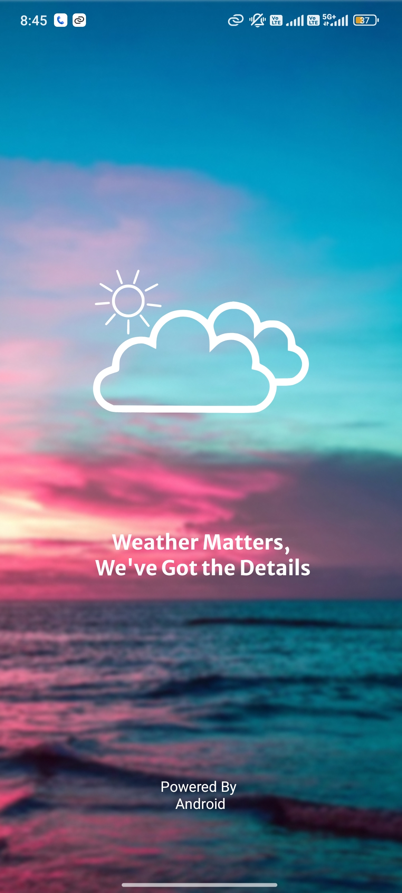
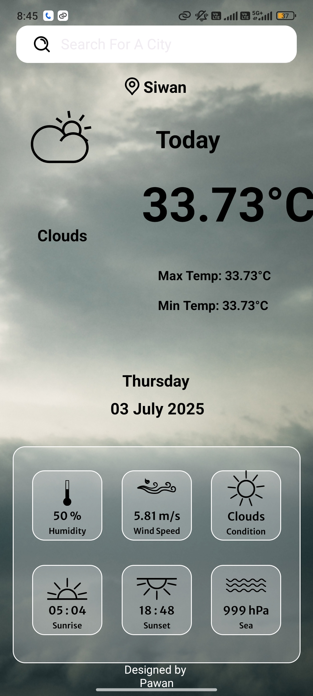

# Weather-App

A simple Android weather application built using Kotlin, XML, and the OpenWeather API. It displays real-time weather information (temperature, humidity, wind speed, etc.) for any city. Designed and developed in Android Studio with a clean and user-friendly interface.

🛠️ Tech Stack

* Kotlin

* XML

* OpenWeather API

* Android Studio

✨ Features

✅ Search for weather by city name

✅ Real-time temperature, humidity, wind speed

✅ User-friendly and minimal UI

✅ Error handling for invalid city names or network issues

📸 Screenshots

## 📸 Screenshots

🚀 Getting Started
1️⃣ Clone the Repository

git clone https://github.com/saurabhkumar2001/Weather-APP

2️⃣ Open Project in Android Studio

3️⃣ Get OpenWeatherMap API Key

Visit: OpenWeatherMap API

Sign up and generate your API key

4️⃣ Add Your API Key
Replace "YOUR_API_KEY" in the code with your actual API key.

5️⃣ Run the App
Use an emulator or a real device running Android API 21+.

🔑 API Used
OpenWeatherMap API for real-time weather data
📖 API Documentation

🔑 API

This app uses the OpenWeatherMap API for fetching weather data.

➡ OpenWeather API Documentation

📌 Requirements

Android Studio (latest version recommended)

Android device or emulator running API 21+

🤝 Contributing

Feel free to fork this repo and submit pull requests!

📄 License

This project is licensed under the MIT License.
